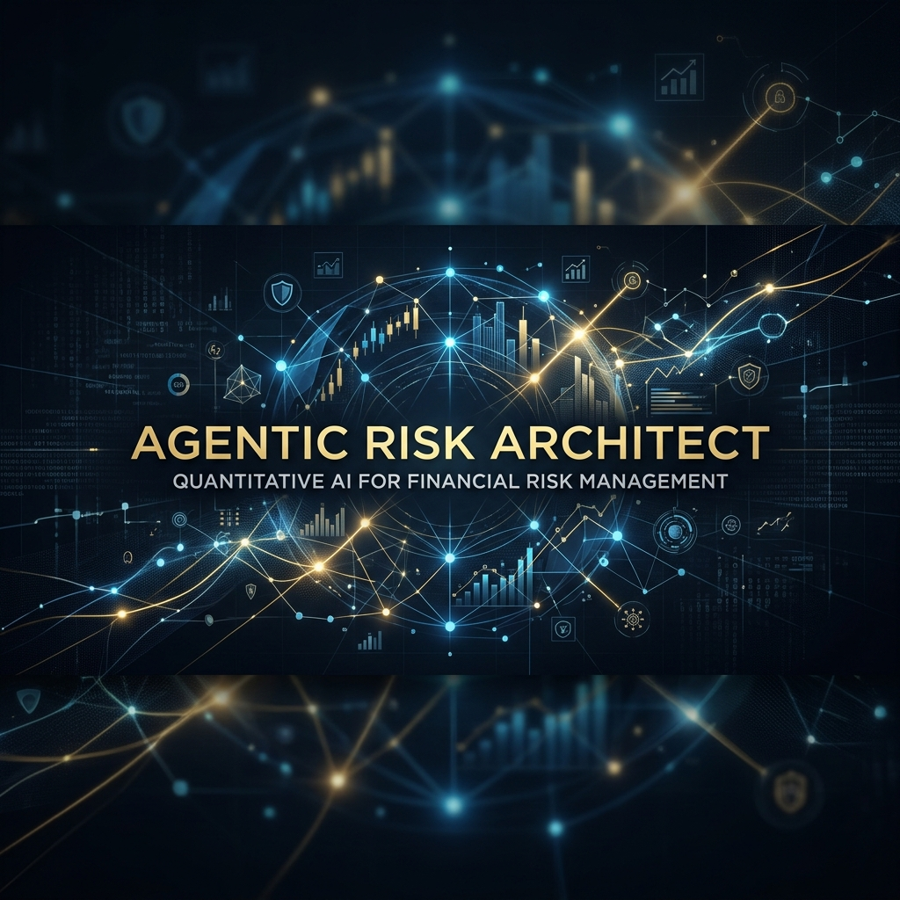
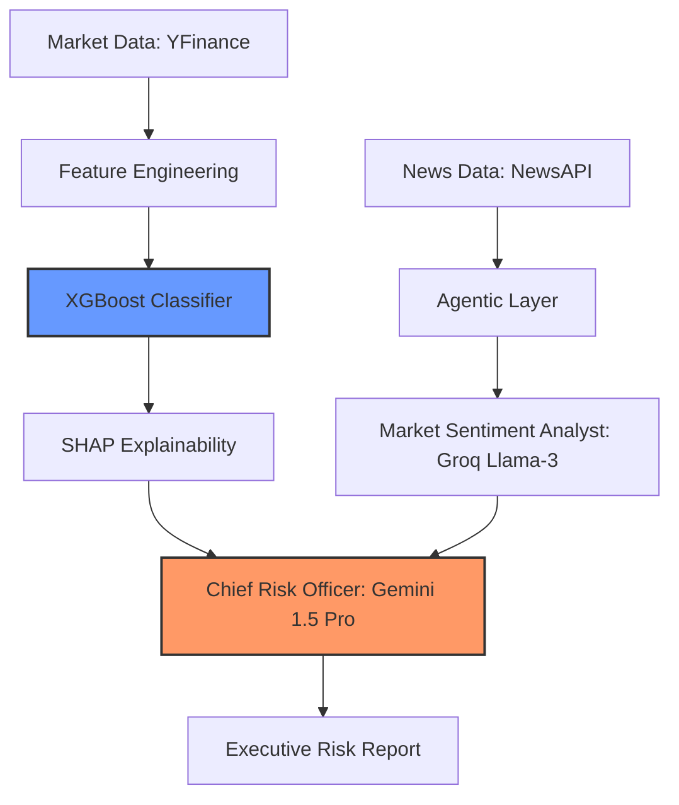

# 🛡️ Agentic Risk Architect
### Autonomous Financial Intelligence & Explainable Risk Orchestration



## 🌟 Overview
**Agentic Risk Architect** is a next-generation financial monitoring system that replaces static risk models with **Autonomous AI Agents**. By fusing high-frequency market data with real-time news sentiment analysis, this system provides a 360-degree "Intelligence Score" rather than just a credit score.

This project was built to demonstrate **MLOps maturity**, **Agentic workflows**, and **Explainable AI (XAI)** standards in high-stakes financial environments.

---

## 🏗️ System Architecture
The system follows a **Hybrid Provider Architecture**, leveraging the strengths of specialized LLMs and classical ML.



### 🛠️ Technical Choice: "The Why"
1. **Explainable AI (SHAP):** Transparency is non-negotiable in finance. We use SHAP to decompose XGBoost predictions into human-readable business drivers (e.g., "Volatility spike in last 5 days contributed 20% to Risk Score").
2. **Hybrid Provider Strategy:** 
   - **Groq (Llama-3-70b):** Used for the *Analyst* role to process news sentiment with sub-second inference speed.
   - **Gemini 1.5 Pro:** Used for the *CRO* role to handle complex reasoning, long-context synthesis, and structured Pydantic output.
3. **Agentic Workflows (CrewAI):** We move beyond RAG into **Autonomous Deliberation**, where agents challenge the ML model's output based on qualitative real-time events.

---

## 🚀 Deployment (The Cloud Handshake)
This app is optimized for **Streamlit Community Cloud**.

### 🔐 Environment Secrets
To run this project, you must configure the following secrets in your Streamlit Cloud Dashboard:
- `GROQ_API_KEY`: For sub-second sentiment analysis.
- `GOOGLE_API_KEY`: For executive reasoning (Gemini 1.5 Pro).
- `NEWS_API_KEY`: For real-time market intelligence.

---

## 💻 Getting Started

### Prerequisites
- Python 3.10+
- API Keys: Groq, Google AI Studio, NewsAPI

### Installation
1. **Clone the repo:**
   ```bash
   git clone https://github.com/KishoreRaghupathy/Agentic-Risk-Architect.git
   cd Agentic-Risk-Architect
   ```

2. **Install dependencies:**
   ```bash
   pip install -r requirements.txt
   ```

3. **Local Setup:**
   Create a `.env` file:
   ```env
   GROQ_API_KEY=your_key
   GOOGLE_API_KEY=your_key
   NEWS_API_KEY=your_key
   ```

4. **Run the App:**
   ```bash
   streamlit run app.py
   ```

---

## 👤 Author
**Kishore Raghupathy**  
*Data Scientist | ML Engineer*  
[LinkedIn](https://www.linkedin.com/in/kishoreraghupathy/) | [GitHub](https://github.com/KishoreRaghupathy)
